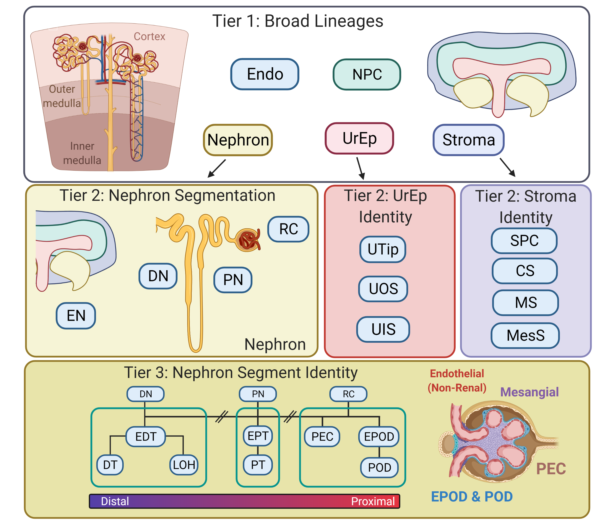

# DevKidCC

<!-- badges: start -->
[](https://www.tidyverse.org/lifecycle/#experimental)
<!-- badges: end -->

**DevKidCC** (*Dev*eloping *Kid*ney *C*ell *C*lassifier) is a tool that will classify single cell kidney data, both human tissue and human stem cell derived organoids. There is no pre-processing required, although we do recommend filtering out poor quality cells for most accurate representation of cell proportions.

bioRxiv paper: [Wilson et al. 2021](https://doi.org/10.1101/2021.01.20.427346)
Genome Medicine: [Wilson et al., 2022](https://genomemedicine.biomedcentral.com/articles/10.1186/s13073-022-01023-z)

<br>

<br>


## Installation

You can install **DevKidCC** from this repository using devtools: 

``` r
# prerequite scPred package
devtools::install_github("powellgenomicslab/scPred")
# DevKidCC itself
devtools::install_github("KidneyRegeneration/DevKidCC", ref = "main")
```
Expected installation time is under 5 minutes for each package.

This package has been successfully tested on both Windows and Linux systems.

## Standard Workflow

Check out the full vignette which includes details on using the visualisation functions [here](https://kidneyregeneration.github.io/DevKidCC/index.html)

### Running DevKidCC

DevKidCC operates on single cell data as a Seurat object. The simplest workflow to use DevKidCC is:

``` r
library(DevKidCC)
# read in seurat object
organoid <- DKCC(organoid)  # use dataset 'organoid' included in package
```
This will cause a number of additional metadata to be added to the object. The first tier is labelled "LineageID" while the complete annotation is under "DKCC"


### Loading organoid gene expression database

The database is stored as an rda file and can be downloaded at the following link:
https://drive.google.com/file/d/1wh551HvecgszizE8FCsXRD5CiQVYm3K6/view?usp=sharing

Save this file in a data folder at the top level of your project. This will allow it to be loaded by the DotPlotCompare function when `compare.to.organoids = T`


Any issues submit a pull request or contact me at sean.wilson@mcri.edu.au

