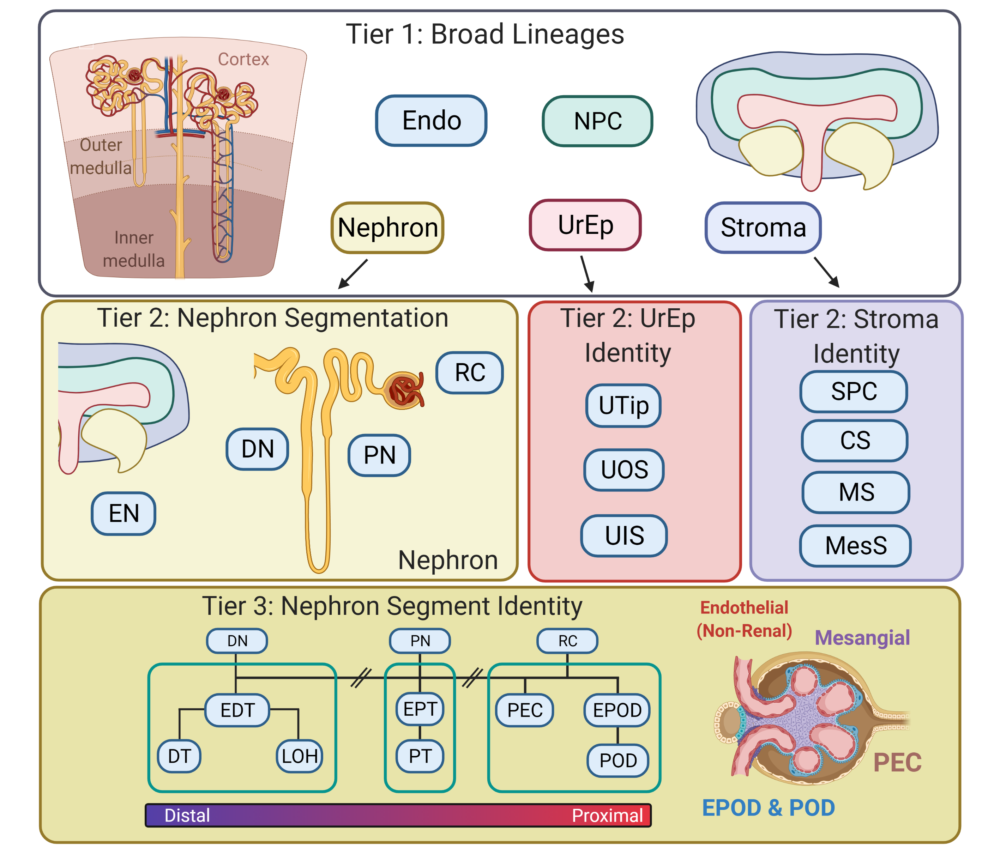

# DevKidCC

<!-- badges: start -->
[](https://www.tidyverse.org/lifecycle/#stable)
[](https://satijalab.org/seurat/)
[](https://github.com/KidneyRegeneration/DevKidCC)
<!-- badges: end -->

**DevKidCC** (*Dev*eloping *Kid*ney *C*ell *C*lassifier) is a tool that will classify single cell kidney data, both human tissue and human stem cell derived organoids. There is no pre-processing required, although we do recommend filtering out poor quality cells for most accurate representation of cell proportions.

**Version 0.5.0** introduces a simplified NPC (Nephron Progenitor Cell) refinement approach for improved Seurat v5 compatibility. NPC cells are now classified as "NPC-like" without PAX2-based clustering refinement. This change resolves data frame compatibility issues while maintaining classification accuracy for all other cell types. See [NEWS.md](NEWS.md) for full details.

**Backward Compatibility Note:** If you have existing analyses using v0.4.0, NPC cell classifications may differ in v0.5.0. Cells previously labeled as "NPC" based on PAX2 expression clustering are now uniformly labeled as "NPC-like". All other cell type classifications remain unchanged. This change improves Seurat v5 compatibility and eliminates data frame errors but removes NPC subtyping granularity.

bioRxiv paper: [Wilson et al. 2021](https://doi.org/10.1101/2021.01.20.427346) <br>
Genome Medicine: [Wilson et al., 2022](https://genomemedicine.biomedcentral.com/articles/10.1186/s13073-022-01023-z)

<br>

<br>


## Installation

### Option 1 — Container (no R or Python installation required)

A pre-built image is published to the GitHub Container Registry on every commit to the release branches. It carries R, Seurat, scPred and DevKidCC alongside Python, anndata and the `devkidcc` wrapper, so **either language can drive the classifier**.

```bash
docker pull ghcr.io/kidneyregeneration/dkcc:latest
```

Check the image is sound before trusting it with your data. This pushes a synthetic matrix through every entry point and takes about three minutes; it needs no input files and no network:

```bash
docker run --rm ghcr.io/kidneyregeneration/dkcc:latest python /opt/smoke_test.py
# ... PASS: the Python API, h5ad routing and .rds routing all classified the input.
```

**The file chooses the entry point.** `.h5ad` is AnnData's format and is read and written by Python; `.rds`, `.RData`, `.h5seurat` and 10x `.h5` are read and written by Seurat. `/opt/dkcc` routes on the extension, so you do not have to:

```bash
# h5ad in, h5ad out -- goes to Python
docker run --rm -v /path/to/your/data:/data \
    ghcr.io/kidneyregeneration/dkcc:latest \
    /opt/dkcc --input /data/sample.h5ad --output /data/sample_DKCC.h5ad

# rds in, rds out -- goes to R
docker run --rm -v /path/to/your/data:/data \
    ghcr.io/kidneyregeneration/dkcc:latest \
    /opt/dkcc --input /data/sample.rds --output /data/sample_DKCC.rds

# Batch: every supported file in a directory, each routed by its own extension
docker run --rm -v /path/to/your/data:/data \
    ghcr.io/kidneyregeneration/dkcc:latest \
    bash /opt/run_dkcc_batch.sh -i /data
```

Both routes end in the same `DevKidCC::DKCC()`; what differs is only which side reads the file. The image does **not** convert between h5ad and Seurat formats — use `sceasy` or `zellkonverter` yourself if you need that.

| Input | Entry point | Output |
|---|---|---|
| `.h5ad` | `/opt/run_dkcc.py` (Python) | `.h5ad` |
| `.rds` `.RData` `.h5seurat` `.h5` | `/opt/run_dkcc.R` (R) | `.rds` |

Either script can also be called directly, with its own options — `--threshold`, `--max-iter`, `--knn-iter` on the Python side; `Rscript /opt/run_dkcc.R --help` on the R side.

**From a scanpy workflow**, skip the CLI and import the wrapper. It shells out to R for you; `DKCC` and `LineageID` come back as `.obs` columns on your AnnData, at its original gene width:

```bash
docker run --rm -v /path/to/your/data:/data \
    ghcr.io/kidneyregeneration/dkcc:latest python -c "
import anndata as ad, devkidcc
adata = ad.read_h5ad('/data/sample.h5ad')
adata = devkidcc.classify_kidney_cells(adata)
print(adata.obs['LineageID'].value_counts())
adata.write_h5ad('/data/sample_DKCC.h5ad')
"
```

Pass raw counts, not log-normalised values — the models were fit against counts, and normalisation happens inside.

**Singularity / Apptainer**, for HPC systems where Docker is unavailable:

```bash
singularity pull dkcc.sif docker://ghcr.io/kidneyregeneration/dkcc:latest
singularity exec --bind /path/to/data:/data dkcc.sif \
    /opt/dkcc --input /data/sample.h5ad --output /data/sample_DKCC.h5ad
```

`run_dkcc.sh` in this repository wraps that call for SLURM clusters — see `HPC_TESTING.md`. Note that Singularity bind-mounts your home directory by default; the image sets `PYTHONNOUSERSITE=1` so a `~/.local` Python install on the host cannot shadow the versions inside it.

The image is built for `linux/amd64`. On Apple Silicon it runs under emulation, slowly.

#### Worked examples

The image carries `/opt/examples`, the same scripts as the `examples/` directory here. They are the CLI calls above written out step by step, with the checks and the label summary spelled out, so they can be read, adapted, or lifted into a methods section:

| Script | What it shows |
|---|---|
| `classify_h5ad.py` | Classifying an AnnData object from Python, with a label-count summary |
| `classify_seurat.R` | The same from R — including normalising a Seurat v5 object first, which `DKCC()` does not do for you |
| `make_test_data.py` | Building the two small test inputs, seeded so they reproduce exactly |
| `build_rds_from_mtx.R` | Building a Seurat `.rds` from a MatrixMarket trio, so both routes can be fed from one source matrix |
| `export_labels.R` | Dumping per-cell labels to CSV |
| `compare_routes.py` | Agreement between the Python and R routes, cell by cell |
| `compare_host_container.py` | Agreement between two environments — the container against your own machine |
| `run_examples.sh` | All of the above over a set of datasets, with a pass/fail summary |

`examples/VALIDATION.md` is the v0.5.1 validation record: all four paths on two datasets, the agreement between the routes (κ 0.94–0.99), and the agreement between container and host (identical, cell for cell).

```bash
singularity exec --bind $PWD:/data dkcc.sif \
    python /opt/examples/classify_h5ad.py --input /data/sample.h5ad \
                                          --output /data/sample_DKCC.h5ad \
                                          --summary /data/sample_labels.csv
```

### Option 2 — R package (devtools)

You can install **DevKidCC** from this repository using devtools: 

``` r
# prerequite scPred package
devtools::install_github("powellgenomicslab/scPred")
# DevKidCC itself
devtools::install_github("KidneyRegeneration/DevKidCC", ref = "main")
```
Expected installation time is under 5 minutes for each package.

This package has been successfully tested on both Windows and Linux systems.

## Standard Workflow

Check out the full vignette which includes details on using the visualisation functions [here](https://kidneyregeneration.github.io/DevKidCC/index.html)

### Running DevKidCC

DevKidCC operates on single cell data as a Seurat object. The simplest workflow to use DevKidCC is:

``` r
library(DevKidCC)
# read in seurat object
organoid <- DKCC(organoid)  # use dataset 'organoid' included in package
```
This will cause a number of additional metadata to be added to the object. The first tier is labelled "LineageID" while the complete annotation is under "DKCC"


### Loading organoid gene expression database

The database is stored as an rda file and can be downloaded at the following link:
https://drive.google.com/file/d/1wh551HvecgszizE8FCsXRD5CiQVYm3K6/view?usp=sharing

Save this file in a data folder at the top level of your project. This will allow it to be loaded by the DotPlotCompare function when `compare.to.organoids = T`


Any issues submit a pull request or contact me at sean.wilson@mcri.edu.au

